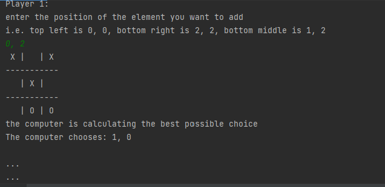

# Tic Tac Toe console game

## Demo
Install the repository and dependancies and run the application. You will need python installed, I used pycharm as the IDE but any should do.

## Table of Contents

- [Description](#description)
- [Installation](#installation)
- [Usage](#usage)
- [Contributors](#contributors)
- [Test](#test)
- [Credits](#credits)
- [License](#license)
- [Questions](#questions)

## Description:
Ever needed to play tic tac tow without any cool visuals. Now you can, play against a friend or play against the worlds worse bot

## Installation:
Using functions and the command line, this application prints a basic as tic tac toe game that is quite fun

## Usage:
The purpose of this project is to develop my python skills, tic tac toe as a fun way to do it. Making a bot to play against was quite fun too

***
  
The image above shows the game in progress on the console.

***

## Contributors:

[Ben Cyna](https://github.com/bencyna/)

## Test:
Install the repository and hit run. Oh and import the dependencies 

## License:

      For additional information about the License, click the link below.

- [License](https://opensource.org/licenses/MIT)

## Questions:

      If you have any questions about the Calendule project, you can follow the link below to navigate to my GitHub page:

- [GitHub Profile](https://github.com/bencyna)

For further information on this project, if you'd like to discuss changes or work together - please reach out directly to: https://www.linkedin.com/in/bencyna567/.